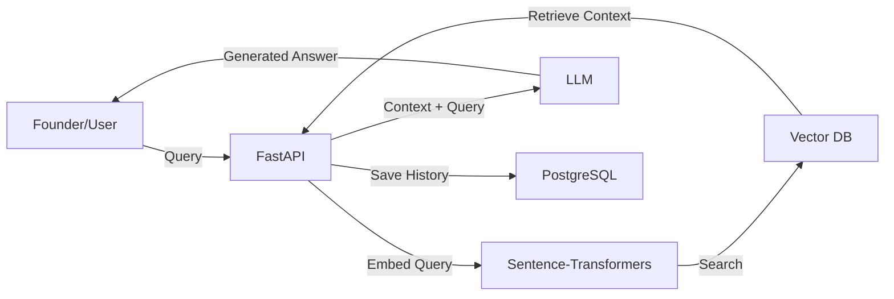

# ⚖️ LegalEdge AI

**LegalEdge AI** is a cutting-edge, RAG-powered (Retrieval-Augmented Generation) assistant designed specifically for Indian startups. It bridges the gap between complex legal regulations and founders by providing an AI assistant grounded in verified official documents (MCA, GST, SEBI), an interactive compliance calendar, and a centralized regulations library.

🚀 **[Live Demo](https://legal-edge-ai-h4cf.vercel.app)**

---

## ✨ Features

- 🤖 **AI Compliance Assistant**: A sophisticated RAG-powered chat interface that provides accurate, source-backed answers based on indexed government PDFs.
- 📅 **Compliance Calendar**: Track and manage critical startup deadlines. Features local and cloud persistence to ensure you never miss a filing.
- 📚 **Regulations Library**: A searchable, centralized repository of official legal documents, acts, and guidelines from Indian authorities.
- 💬 **Persistent Chat History**: Securely store and retrieve your conversations, powered by Neon PostgreSQL.
- 🔐 **Secure Authentication**: Built-in user authentication and management using Firebase.
- 🎨 **Premium UI/UX**: Fluid, responsive design with glassmorphism aesthetics, dark mode support, and smooth Framer Motion animations.

---

## 🛠️ Tech Stack

### Frontend
- **Framework**: [React 19](https://react.dev/) (Vite)
- **Language**: [TypeScript](https://www.typescriptlang.org/)
- **Styling**: [Tailwind CSS](https://tailwindcss.com/)
- **Animations**: [Framer Motion](https://www.framer.com/motion/)
- **Auth**: [Firebase](https://firebase.google.com/)

### Backend
- **API**: [FastAPI](https://fastapi.tiangolo.com/) (Python)
- **LLM**: [Groq](https://groq.com/) (Mixtral/Llama 3)
- **Vector DB**: [FAISS](https://github.com/facebookresearch/faiss)
- **Embeddings**: Sentence-Transformers
- **Database**: [Neon](https://neon.tech/) (Serverless PostgreSQL)

---

## 🏗️ Architecture (RAG Pipeline)



---

## 📦 Setup & Installation

### Prerequisites
- Python 3.10+
- Node.js 18+
- Groq API Key
- Firebase Configuration
- Neon PostgreSQL URL

### 1. Clone & Configure
```bash
git clone https://github.com/eshwar2005/LegalFinanceApp.git
cd LegalFinanceApp
```

### 2. Backend Setup
```bash
cd backend
python -m venv venv
source venv/bin/activate  # On Windows: .\venv\Scripts\activate
pip install -r requirements.txt
# Create a .env file with GROQ_API_KEY and DATABASE_URL
python main.py
```

### 3. Frontend Setup
```bash
cd ../frontend
npm install
# Create a .env file with VITE_API_URL and Firebase configs
npm run dev
```

---

## 🔄 Deployment

- **Frontend**: Deployed on [Vercel](https://vercel.com/)
- **Backend**: Deployed on [Render](https://render.com/) / [Koyeb](https://koyeb.com/)
- **Database**: [Neon PostgreSQL](https://neon.tech/)

---

## 🔗 Author
Developed with ❤️ by [eshwar2005](https://github.com/eshwar2005).
